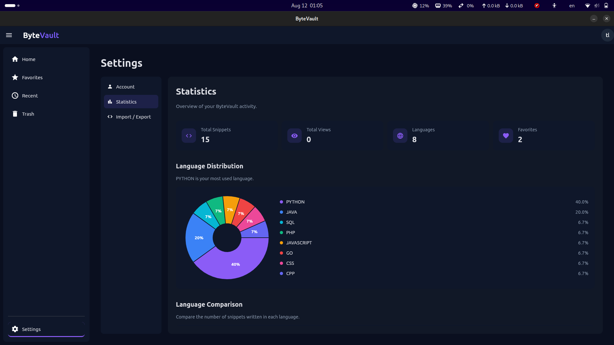

# ByteVault

<p align="center">
  
</p>

<h3 align="center">A clean, local-first code snippet manager for developers.</h3>

<p align="center">
  Store, organize, edit, search, and revisit your code snippets in one focused desktop application.
</p>

<p align="center">
  
  
  
</p>

---

## ✨ Overview

**ByteVault** is a desktop application built with **Python and Flet** for developers who frequently save and reuse code snippets.

Instead of keeping useful pieces of code scattered across text files, notes, chat messages, or browser tabs, ByteVault provides a focused workspace for storing and managing them.

ByteVault combines a clean dark interface with a modular architecture, database migrations, snippet organization, statistics, favorites, local user settings, and encrypted snippet export.

> **Local-first by design.**
>
> ByteVault is designed around keeping your snippets under your control rather than requiring a cloud-based developer platform.

---


## 🚀 Features

### 📝 Snippet Management

* Create new code snippets
* Edit existing snippets
* View snippets in a dedicated interface
* Syntax-aware code editor
* Organize snippets by programming language
* Language-specific icons
* Recently updated snippets
* Human-readable relative timestamps
* Soft-delete support
* Delete all snippets with confirmation

### ⭐ Favorites

* Mark snippets as favorites
* Quickly identify frequently used snippets
* Dedicated favorite state stored in the database

### 📊 Statistics

ByteVault includes a statistics dashboard that gives you an overview of your snippet collection.

* Total number of snippets
* Total views
* Total favorites
* Programming language distribution
* Language usage percentages
* Visual charts powered by `flet-charts`

Example:

<p align="center">
  
</p>

### 👤 Account Settings

ByteVault includes a persistent local user profile.

You can manage:

* First name
* Last name
* Bio
* Profile information

### 📦 Import & Export

ByteVault supports exporting and importing snippets using its own file format:

```text
.bytv
```

Exported ByteVault files are encrypted so their contents are not stored as plain-text snippets.

This makes it possible to:

* Back up your snippets
* Move snippets between ByteVault installations
* Import previously exported snippets
* Keep exported snippet data protected

### 🎨 UI & Experience

* Clean dark interface
* Minimal developer-focused design
* Language-specific programming icons
* Focused snippet workflow
* Responsive Flet-based interface
* Desktop-first experience

---

## 🖥️ Screenshots

### Home

<p align="center">
  
</p>

---

## 🛠️ Tech Stack

ByteVault is built entirely with Python.

| Technology            | Purpose                             |
| --------------------- | ----------------------------------- |
| **Python**            | Core programming language           |
| **Flet**              | Desktop UI framework                |
| **Flet Code Editor**  | Syntax-aware code editing           |
| **Flet Charts**       | Statistics and data visualization   |
| **SQLAlchemy**        | ORM and database interaction        |
| **Alembic**           | Database migrations                 |
| **Pydantic Settings** | Application configuration           |
| **python-dotenv**     | Environment configuration           |
| **OpenAI SDK**        | AI-related application capabilities |

---

## 📦 Dependencies

Main project dependencies:

```text
flet>=0.86.4
flet-code-editor>=0.86.4
flet-charts==0.86.5
SQLAlchemy>=2.0.51
alembic>=1.18.5
python-dotenv>=1.2.2
pydantic-settings>=2.14.2
openai==3.0.0
```

---

## 🏗️ Architecture

ByteVault follows a modular architecture with a clear separation between the UI, database layer, repositories, and utility functions.

```text
ByteVault/
│
├── alembic/
│   ├── env.py
│   ├── README
│   ├── script.py.mako
│   └── versions/
│
├── assets/
│   ├── languages/
│   │   ├── CPP.svg
│   │   ├── CSS.svg
│   │   ├── GO.svg
│   │   ├── JAVASCRIPT.svg
│   │   ├── JAVA.svg
│   │   ├── PHP.svg
│   │   ├── PYTHON.svg
│   │   ├── RUST.svg
│   │   └── SQL.svg
│   │
│   └── logo.png
│
├── database/
│   ├── config.py
│   ├── db.py
│   ├── models.py
│   └── __init__.py
│
├── repositories/
│   ├── snippet.py
│   ├── statistics.py
│   └── user.py
│
├── utils/
│   ├── crypto.py
│   ├── greeting.py
│   └── time_ago.py
│
├── views/
│   ├── add_snippet.py
│   ├── edit_snippet.py
│   ├── home.py
│   ├── loading_page.py
│   ├── settings.py
│   ├── view_snippet.py
│   ├── welcome.py
│   └── __init__.py
│
├── alembic.ini
├── main.py
├── requirements.txt
├── ui.png
├── statistics_ui.png
└── demo.gif
```

### Layer Responsibilities

#### `views/`

Contains the application's user interface and individual screens.

Examples include:

* Home
* Add Snippet
* Edit Snippet
* View Snippet
* Settings
* Welcome
* Loading

#### `database/`

Responsible for:

* Database configuration
* SQLAlchemy setup
* Database models
* Session management

#### `repositories/`

Contains the application's data-access logic.

Repository functions keep database queries separated from the UI layer.

Examples:

* Snippet operations
* User operations
* Statistics queries

#### `utils/`

Contains reusable application utilities.

Examples:

* Encryption
* Relative timestamps
* Greeting helpers

#### `alembic/`

Contains database migration configuration and migration history.

#### `assets/`

Contains:

* ByteVault logo
* Programming language icons
* Other application assets

---

## 🗄️ Database

ByteVault uses a relational database through **SQLAlchemy**.

Database schema changes are managed using **Alembic**.

To apply the latest migrations:

```bash
alembic upgrade head
```

To create a new migration after changing the SQLAlchemy models:

```bash
alembic revision --autogenerate -m "describe your changes"
```

The local database file and environment-specific configuration should not be committed to Git.

---

## 🔐 Data Protection

ByteVault includes encryption for exported `.bytv` files.

The goal is to prevent exported snippets from being stored as readable plain text.

The encryption functionality is implemented separately from the UI inside:

```text
utils/crypto.py
```

The encryption key is provided through environment configuration and should never be committed to the repository.

> Never commit your real `.env` file or encryption key to Git.

---

## ⚙️ Configuration

ByteVault uses environment variables for configuration.

Create a `.env` file in the project root:

```env
DATABASE_URL=your_database_url
BYTEVAULT_ENCRYPTION_KEY=your_encryption_key
```

The `.env` file should remain private and must not be committed to Git.

A `.env.example` file can be used to document the required environment variables without exposing real credentials.

---

## 📥 Installation

### 1. Clone the repository

```bash
git clone https://github.com/Atila-Pasha/ByteVault.git
cd ByteVault
```

### 2. Create a virtual environment

Linux/macOS:

```bash
python -m venv .venv
source .venv/bin/activate
```

Windows:

```powershell
python -m venv .venv
.venv\Scripts\activate
```

### 3. Install dependencies

```bash
pip install -r requirements.txt
```

### 4. Configure the environment

Create a `.env` file in the project root and configure the required variables.

```env
DATABASE_URL=your_database_url
BYTEVAULT_ENCRYPTION_KEY=your_encryption_key
```

### 5. Run migrations

```bash
alembic upgrade head
```

### 6. Start ByteVault

```bash
python main.py
```

Or using Flet:

```bash
flet run main.py
```

---

## 🐧 Building for Linux

ByteVault can also be packaged as a Linux desktop application using Flet.

```bash
flet build linux
```

The application uses its own logo and assets during the build process.

---

## 🧭 Project Philosophy

ByteVault is intentionally focused.

The goal is not to become another complicated developer platform.

Instead, ByteVault aims to make one simple workflow feel good:

> **Save code → organize it → find it later → reuse it.**

The project is also a practical playground for exploring:

* Python application architecture
* Desktop application development
* Flet
* SQLAlchemy
* Alembic
* Repository patterns
* Database design
* Encryption
* Data visualization
* Local-first application design
* Developer-focused UI/UX

---

## 🗺️ Roadmap

Some possible future improvements include:

* [ ] Advanced snippet search
* [ ] Tags and categories
* [ ] Keyboard shortcuts
* [ ] More export formats
* [ ] Improved snippet organization
* [ ] More detailed statistics
* [ ] Cross-platform packaging improvements
* [ ] Improved backup and restore workflow
* [ ] Additional editor features

---

## 🤝 Contributing

Contributions, ideas, bug reports, and suggestions are welcome.

If you find a bug or have an idea that could improve ByteVault:

1. Open an issue
2. Describe the problem or feature
3. Provide steps to reproduce the issue when applicable
4. Submit a pull request if you have a solution

---

## 📄 License

ByteVault is released under the **MIT License**.

---

<p align="center">
  Built with ❤️ using Python and Flet.
</p>

<p align="center">
  
</p>

