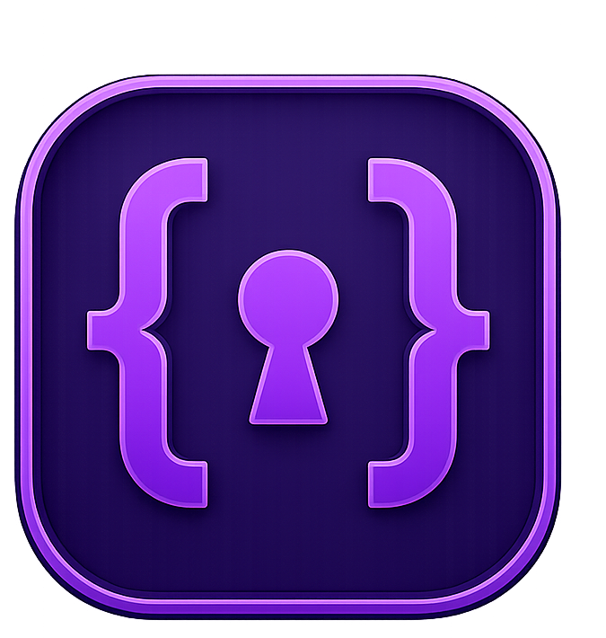
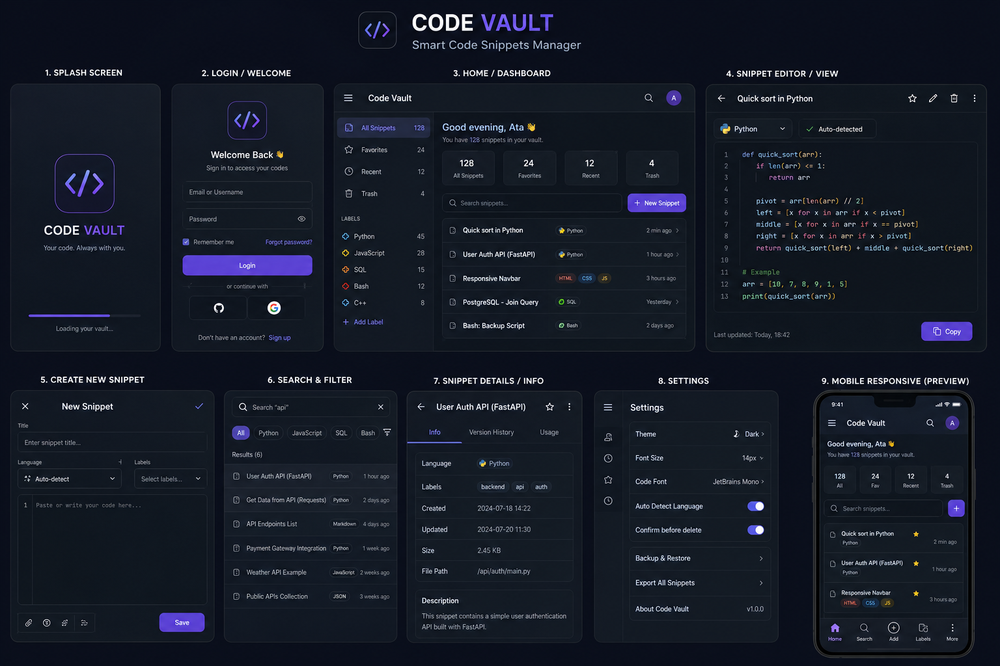

# ByteVault

<p align="center">
  
</p>

<h3 align="center">A clean and local-first code snippet manager.</h3>

<p align="center">
  Store, organize, edit, and revisit your code snippets in one focused desktop application.
</p>

---

## Overview

**ByteVault** is a lightweight desktop application built with Python and Flet for developers who frequently reuse code snippets.

Instead of keeping useful pieces of code scattered across text files, notes, chat messages, or browser tabs, ByteVault provides a simple place to save and manage them locally.

The project is designed with a clean dark interface, a lightweight local database, database migrations, and a modular architecture that keeps the UI, database, and data-access layers separated.

> **Local-first by design.**
> Your snippets are stored locally and ByteVault does not require an online account or external backend.

---

## Features

* Create and save code snippets
* Edit existing snippets
* View snippets in a dedicated interface
* Organize snippets by programming language
* Language-specific icons
* Mark snippets as favorites
* Soft-delete snippets
* Recently updated snippets
* Human-readable relative timestamps
* Local SQLite database
* Database migrations with Alembic
* Syntax-aware code editor
* Persistent local user profile
* Dark, minimal desktop interface

---

## Screenshots

<p align="center">
  
</p>

---

## Tech Stack

ByteVault is built entirely with Python and uses the following technologies:

| Technology            | Purpose                      |
| --------------------- | ---------------------------- |
| **Python**            | Core programming language    |
| **Flet**              | Desktop application UI       |
| **Flet Code Editor**  | Code editing experience      |
| **SQLAlchemy**        | ORM and database interaction |
| **Alembic**           | Database migrations          |
| **python-dotenv**     | Environment variable loading |
| **Pydantic Settings** | Application configuration    |

### Dependencies

```text
flet>=0.86.4
flet-code-editor>=0.86.4
SQLAlchemy>=2.0.51
alembic>=1.18.5
python-dotenv>=1.2.2
pydantic-settings>=2.14.2
```

---

## Architecture

ByteVault follows a modular architecture with a clear separation between the user interface, database layer, repositories, and utilities.

```text
ByteVault/
│
├── alembic/
│   ├── env.py
│   ├── README
│   ├── script.py.mako
│   └── versions/
│       ├── 1546a147697f_add_favorite_deleted_and_timestamps_to_.py
│       ├── 648c42d991c9_change_time_saving_logic.py
│       ├── 78bdbbdca9e2_adding_is_favorite_and_is_deleted.py
│       └── e79393806047_initial_commit.py
│
├── assets/
│   ├── languages/
│   │   ├── CPP.svg
│   │   ├── CSS.svg
│   │   ├── GO.svg
│   │   ├── JAVASCRIPT.svg
│   │   ├── JAVA.svg
│   │   ├── PHP.svg
│   │   ├── PYTHON.svg
│   │   ├── RUST.svg
│   │   └── SQL.svg
│   └── logo.png
│
├── database/
│   ├── config.py
│   ├── db.py
│   ├── __init__.py
│   └── models.py
│
├── repositories/
│   ├── snippet.py
│   └── user.py
│
├── utils/
│   ├── greeting.py
│   └── time_ago.py
│
├── views/
│   ├── add_snippet.py
│   ├── edit_snippet.py
│   ├── home.py
│   ├── loading_page.py
│   ├── view_snippet.py
│   ├── welcome.py
│   └── __init__.py
│
├── alembic.ini
├── main.py
├── requirements.txt
└── ui.png
```

### Layer Responsibilities

**`views/`**

Contains the application's user interface and individual application screens.

**`database/`**

Responsible for database configuration, SQLAlchemy setup, and application models.

**`repositories/`**

Contains data-access logic and keeps database queries separate from the UI layer.

**`utils/`**

Contains reusable helper functions used throughout the application.

**`alembic/`**

Contains database migration configuration and migration history.

**`assets/`**

Stores the application logo and programming-language icons used throughout the UI.

---

## Database

ByteVault uses **SQLite** as its local database.

The database itself is intentionally excluded from version control:

```text
database.db
```

Database schema changes are managed through **Alembic migrations**.

To apply the latest migrations:

```bash
alembic upgrade head
```

To create a new migration after modifying the models:

```bash
alembic revision --autogenerate -m "describe your changes"
```

---

## Configuration

ByteVault uses environment variables for configuration.

Create a `.env` file in the project root:

```env
DATABASE_URL=your_database_url
```

> The `.env` file is intentionally excluded from Git to prevent credentials and environment-specific configuration from being committed.

---

## Installation

### 1. Clone the repository

```bash
git clone https://github.com/YOUR_USERNAME/ByteVault.git
cd ByteVault
```

### 2. Create a virtual environment

```bash
python -m venv .venv
```

Activate it on Linux/macOS:

```bash
source .venv/bin/activate
```

On Windows:

```powershell
.venv\Scripts\activate
```

### 3. Install dependencies

```bash
pip install -r requirements.txt
```

### 4. Configure the environment

Create a `.env` file in the project root and add your database configuration:

```env
DATABASE_URL=your_database_url
```

### 5. Run database migrations

```bash
alembic upgrade head
```

### 6. Start ByteVault

```bash
python main.py
```

You can also run the application using Flet:

```bash
flet run main.py
```

---

## Project Philosophy

ByteVault is intentionally simple.

The goal is not to build another complicated developer platform, but to create a focused tool that makes saving and retrieving small pieces of code fast and comfortable.

The project also serves as a practical playground for exploring:

* Python application architecture
* Flet desktop development
* SQLAlchemy
* Database migrations
* Repository patterns
* Local-first application design
* Clean UI/UX for developer tools

---

## Roadmap

Possible future improvements include:

* [ ] Search and filtering
* [ ] Tagging system
* [ ] Keyboard shortcuts
* [ ] Clipboard integration
* [ ] Import and export
* [ ] Code snippet duplication
* [ ] More programming languages
* [ ] Custom themes
* [ ] Backup and restore
* [ ] Packaging ByteVault as a standalone desktop application

---

## Contributing

Contributions, ideas, and suggestions are welcome.

If you find a bug or have an idea that could improve ByteVault, feel free to open an issue or submit a pull request.

---

## License

This project is currently available for personal and educational use.

A formal open-source license may be added in the future.

---

<p align="center">
  Built with Python and Flet.
</p>
